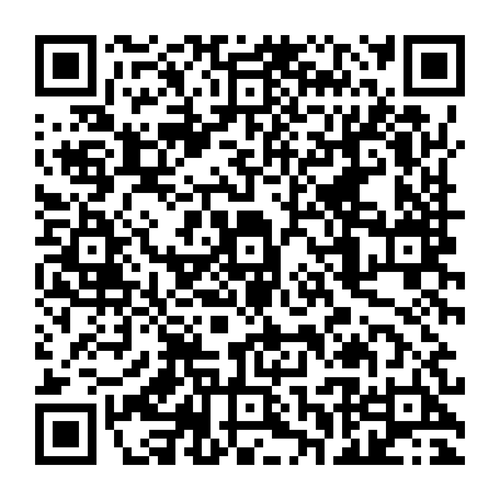

# Automatic Parking Barrier Demonstration

Grade 12 CBC Robotics practical demonstration using an Arduino Uno, HC-SR04 ultrasonic sensor and SG90 servo.

## Watch

[Open the demonstration video](https://doritexpublishing.github.io/Automated_Parking_Barrier_Demonstration/)

The repository includes the narrated MP4, poster frame, English captions and a GitHub Pages deployment workflow.

[Open the printable QR poster](qr-poster.png)
